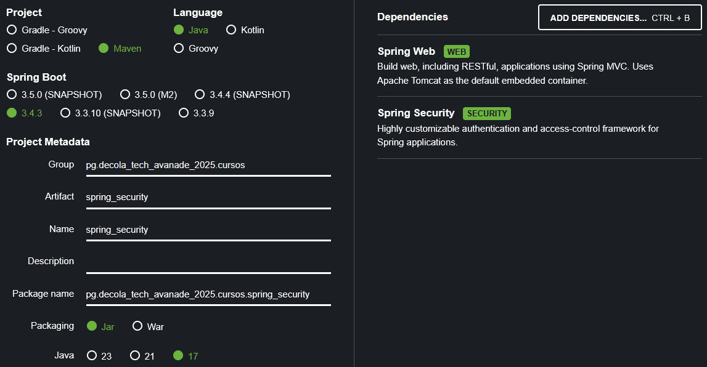

# Projeto de estudo, seguindo o conteúdo apresentado no curso 'Adicionando Segurança a uma API REST com Spring Security'
O repositório contém, além das anotações nesse documento, um projeto Spring Boot desenvolvido seguindo o conteúdo apresentado na aula.
Caso haja divergência deixo claro, em comentários no código, o porquê de ter divergido da implementação demonstrada no curso.

## Setup
### Estrutura do projeto + dependências iniciais
O projeto foi estruturado da com ajuda da ferramenta [Spring Initializr](start.spring.io);
A seguinte configuração foi utilizada, incluindo dependências que, acredito, serão relevantes no curso.

